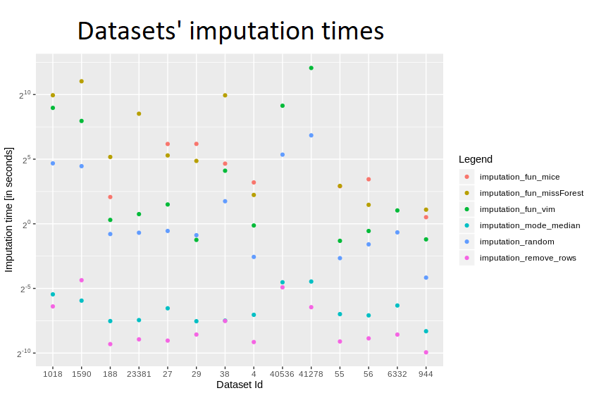
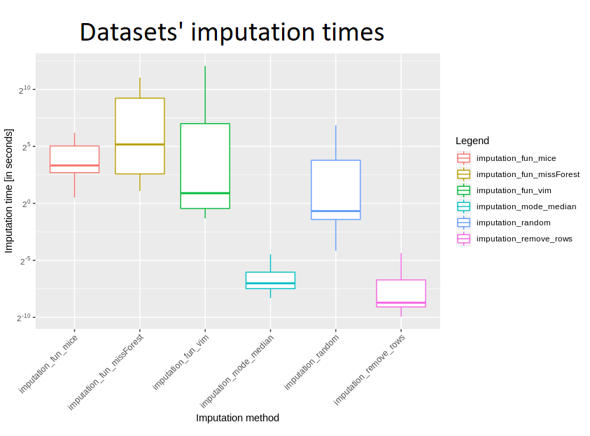
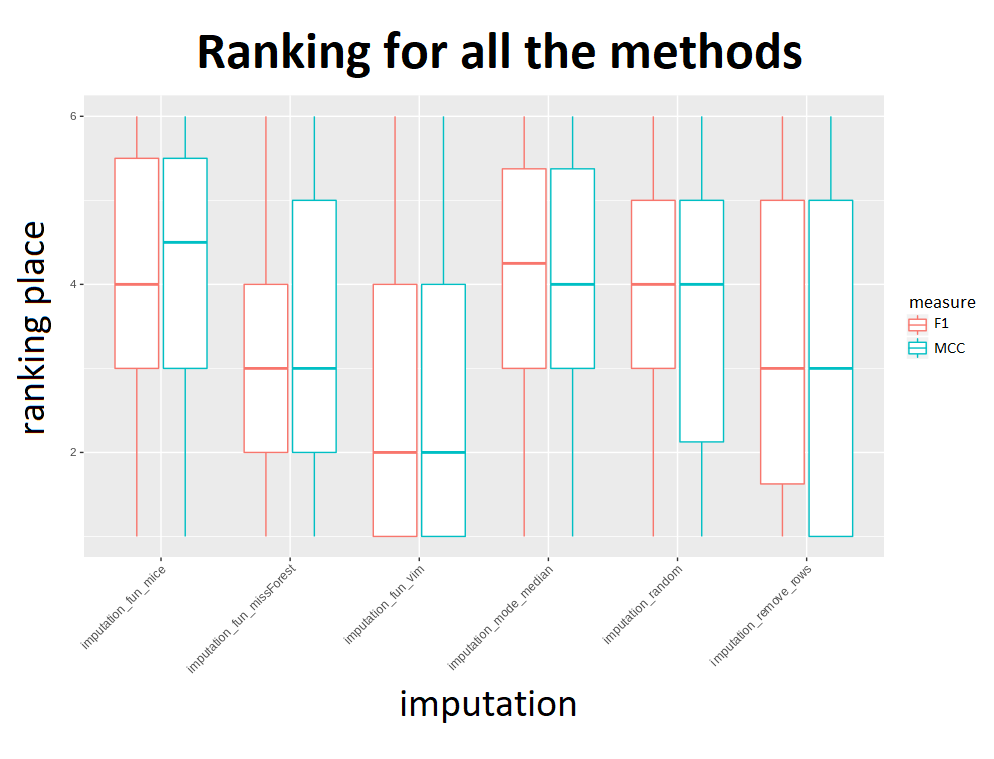
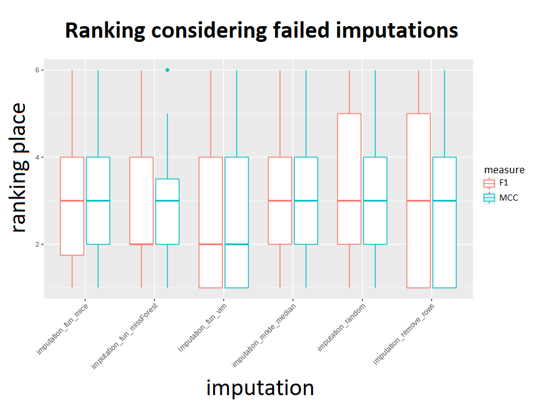

```{r setup, include=FALSE}
knitr::opts_chunk$set(echo = TRUE, cache = TRUE)
getwd()
```

# Abstract

There are many different ways of dealing with missing values. Depending on their quantity and properties, various methods turn out to be the best. The fact is, there is no one universal best method of imputation, and different problems require various solutions. Using one and the same solution for each dataset is certainly not the best option, but sometimes it is convenient or even necessary to focus on one particular method without much insight into its effect - for example, when time limits us, or when with due to the complexity of the algorithm or class of problems, we are forced to choose only one method.

In this chapter which we decided to name *The Hajada Imputation Test* (taken from the first two letters of creators' names) we'll take a look at several popular imputation methods and try to compare them with each other, including ranking of algorithms taken into account and finally choosing the best one. Obviously its result will not be the final verdict declaring which imputation algorithm is clearly better or worse, but considering the comparison of their quality on different datasets, we will be able to assess their collective performance and effectiveness against the backdrop of the whole. For this purpose, we'll test the modified collections for getting rid of empty values on several machine learning classification algorithms, and then considering the selected quality measures after comparing the results, we'll get the desired view. Due to the need to obtain a clear and interpretable result, we have limited ourselves to the problem of binary classification.

# Introduction + motivation

In statistics, imputation is the process of replacing missing data with substituted values. Over the years, humanity has met many different methods of it, including the simple and instinctive ones but also more advanced and hard to be easily explained. Choosing the best-suited imputation method for the dataset with missing values is still the daily dilemma of every data scientist and there isn't one universally recognized best model. Some scientists believe the crux lies in the most advanced and sophisticated algorithms, the others trust the simplest of all possible.

## Imputation functions

Six different methods have been taken into consideration. Their selection is well thought out - they are all widely known in the world of Data Science, and at the same time they differ significantly in approach, implementation, concept and results. Comparing them not only results in a good view of the strictly indicated implementations, but also what result subsequent approaches result in.

We'll look at the three simple imputation methods and three more advanced algorithms offered by popular packages. The clash of implementations with such a degree of diversity of complexity will give a clear message whether it pays to reach because the advanced algorithm from the package prepared by professionals for many hours conducted on many tests or can, however, stay with minimalism and write easy code solving the problem in a trivial way.

Methods compared in subsequent stages are:

1. *mode / median replace* - basic process which puts in a place of missing data median cells from their columns for numerical values and dominants for categorical ones.
2. *remove rows* - trivial solution of removing rows containing any missing data.
3. *bogo replace* - simple algorithm replacing NA values with random numbers or factors from their columns.
4. *mice* ^1^ - advanced method creating multiple imputations for multivariate missing data, based on *Fully Conditional Specification* ^2^, where each incomplete variable is imputed by a separate model. Standard imputation with *maxit* parameter of value 0 and default 5 number of imputed datasets.
5. *VIM* ^3^ - standard k-nearest neighbors algorithm taken from the library.
6. *missForest* ^4^ - simple imputation based on random forest offered by the package.

## Datasets

The fourteen data frames were taken from **OpenML100 collection** and were corrected specifically for this research. Both small and simple frames were chosen, as well as more complex and containing a lot of information, difficult to explain or present. They can be found under the following identifiers with the following names: 1590 - *adult*, 188 - *eucalyptus*, 23381 - *dresses-sales*, 29 - *credit-approval*, 38 - *sick*, 40536 - *SpeedDating*, 41278 - *okcupid-stem*, 56 - *vote*, 6332 - *cylinder-bands*, 1018 - *ipums_la_99-small*, 27 - *colic*, 4 - *labor*, 55 - *hepatitis* and 944 - *echoMonths*.

Those above have been placed in individual directories identified by id in the prepared directory.

The six imputations mentioned earlier were released on all fourteen of them, but only on six imputations was successful in their entirety.

## Binary classification algorithms

In order to compare the quality of the imputed data and see how this supplementation of deficiencies works in practice, five binary classification algorithms have been selected. Her choice was made after careful analysis and extensive discussion, in order to find models that are both widely known and used, and also apply to different approaches and give reasonably distinguishable results using different techniques. The final choice fell on:

* *classification tree from rpart^5^* - classic algorithm which uses a decision tree to go from observations about an item to conclusions about the item's target value,
* *k-Nearest Neighbors from class^6^ package* - standard knn model attributing a given observationto a target corresponding to its closest observations in space,
* *naive Bayes from e1071^7^* - well-known classification computing the conditional a-posterior probabilities of a categorical class variable given independent predictor variables using the Bayes rule.
* *random forest from ranger^8^* - algorithm consisting of many decisions trees uses bagging and feature randomness when building each individual tree to try to create an uncorrelated forest of trees whose prediction by committee is more accurate than that of any individual tree.
* *Support Vector Machine from e1071^7^* -  a discriminative classifier formally defined by a separating hyperplane.

# Description of methodology and results

## Reading datasets

In order to read all datasets we used another function, which returned a dataframe containing all the important informations about the test matrices. The generated frames of imputation results and times were saved using parallel processing^9^.

## Metrics functions

In order to test the same test-train splits we used random seed 1357 for all datasets. For each machine learning model after every imputation was created confusion matrix and the values of four basic metrics:

* *accuracy* - $\frac{TP+TN}{TP+FP+FN+TN}$
* *precision* - $\frac{TP}{TP+FP}$
* *recall* - $\frac{TP}{TP+FN}$
* *f1* - $2*\frac{Recall * Precision}{Recall + Precision}$

... in the final conclusion the final ranking concerned only the last one. Additionally, Matthews correlation coefficient measures were also counted.

${\displaystyle {\text{MCC}}={\frac {{\mathit {TP}}\times {\mathit {TN}}-{\mathit {FP}}\times {\mathit {FN}}}{\sqrt {({\mathit {TP}}+{\mathit {FP}})({\mathit {TP}}+{\mathit {FN}})({\mathit {TN}}+{\mathit {FP}})({\mathit {TN}}+{\mathit {FN}})}}}}$

These two give good information about the quality of imputation and a good comparison. It resulted in simple and clear information about which observations are well classified, which ones are wrong and how they should be. Considering the number of sets to consider and their different properties, even when it comes to balancing, comparing these four measures, the fact that it will show the pros and cons of given imputations, will additionally be good to compare them.

## Comparing imputation times

A dataframe containing information about imputation methods was built.




Judging by the logarithmic scale, no surprise removing rows and median replenishment are definitely the fastest methods, with removing rows being several times faster. what would you expect, also "random rows" was quite fast, but slower than the two mentioned.Looking at more advanced ones, definitely *VIM* turned up to be the fastest - probably usually something like 5-10 times more than *mice* and *missForest*. These last two are quite slow, with the missforest appearing to be slightly faster.

To better view a boxplot was also created.




Taking into account all the imputations which have been implemented, it is clearly seen that two first mentioned ones really stand out. However, we cannot fully compare the other three - due to the fact that missForest failed on three data sets, and mice - up to seven.

Considering such a large spread of data size, it is very interesting difference between the median and the average for VIM - the first is almost seven minutes, the second - barely one and a half seconds. In general, however, it is certainly much longer than methods for removing incomplete rows and filling with median.

Also was compared time for those datasets for which all imputations were successful - these are ids 27, 38, 55, 56, 944, 188  (dataset with id 4 softened on removing rows containing any missing items, because each of its poems had some missing items). Taking into account the mean time, definitely *missForest* was the slowest, but also its standard deviation seemed to be incomparably huge - this is probably due to the fact that for smaller sets it is doing well, but due to its complexity, its slowdown can be seen for very large datasets. *VIM* turned out bo be better for quick calculations than *missForest* and *mice*, and considering the median, *mice* is comparable to *missForest* - so for small data sets there is not much difference between them, and a lot of time was definitely needed to devote to these larger data frames.

## Best measures

In order to compare *F1* and *MCC* measures, mean results of measures on all sets for all imputations were calculated. Then for each machine learning algorithm a ranking was created - so that the best result was obtained in the first, second - 2nd, etc. The results came out as shown by this boxplot:




It might seem that the results of the methods are very close to each other, but the above visualization takes into account all measures - to get the correct comparison there is a need to make a ranking only for the sets for which all imputations have passed. And it looks like the picture below.



Considering the imputation times and results, it can be said that the knn algorithm from the VIM package proved to be "universally" the best. With the original methods it falls out the fastest, and the results also have the best. However, it is more difficult to choose second and subsequent places - looking at the results, the methods are very quick, but they differ from the more advanced ones. Looking at the advanced ones, with the exception of VIM, MissForest stands out. However, his problem is time. So after VIM, it seems second best to use mean / median for a small amount of time and missForest for a large one. However, there was no huge difference in results between the methods - which, however, is not visible in the charts, "removeRows" is characterized by large fluctuations, which we advise against.

# Conclusion

The experiment can be considered successful when it comes to the datasets and tools made available to us - calculated measures, visualizations made, as well as conclusions led us, among others, to the intuition that probably *VIM* is really a very good package, supplementing the missing values with medians from columns is not at all is such a stupid idea as it may seem and *missForest* is also noteworthy - if we have time for running it and the dataset isn't too huge. Unfortunately, it is impossible to draw a wise conclusion based on such a small number of tested data - admittedly as many as 14 sets, problems with imputations on some of them or too small dataframes not giving a satisfactory answer and assumptions that respectful statistics would praise. Nevertheless, above code is certainly very valuable and for more data sets it could confirm one or another belief.
## References

*^1^mice: Multivariate Imputation by Chained Equations, package created by Stef van Buuren, Karin Groothuis-Oudshoorn, Gerko Vink, Rianne Schouten, Alexander Robitzsch, Lisa Doove, Shahab Jolani, Margarita Moreno-Betancur, Ian White, Philipp Gaffert, Florian Meinfelder, Bernie Gray*

*^2^Fully conditional specification: Imputes multivariate missing data on a variable-by-variable basis (Van Buuren et al. 2006; Van Buuren 2007a).*

*^3^VIM: Visualization and Imputation of Missing Values, package created by Matthias Templ, Alexander Kowarik, Andreas Alfons, Bernd Prantner*
*^4^missForest: Nonparametric Missing Value Imputation using Random Forest Daniel J. Stekhoven*

*^5^rpart: Recursive Partitioning and Regression Trees, package by Terry Therneau, Beth Atkinson, Brian Ripley*

*^6^class: Various functions for classification, including k-nearest neighbour, Learning Vector Quantization and Self-Organizing Maps, package created by Brian Ripley, William Venables*

*^7^e1071: Misc Functions of the Department of Statistics, Probability Theory Group (Formerly: E1071), TU Wien, package created by David Meyer*

*^8^ranger: A Fast Implementation of Random Forests, package created by Marvin N. Wright, Stefan Wager, Philipp Probst*

*^9^parallel: Support for parallel computation, including by forking (taken from package multicore), by sockets (taken from package snow) and random-number generation*

*^10^Matthews correlation coefficient: a measure of the quality of binary (two-class) classifications, introduced by biochemist Brian W. Matthews in 1975*